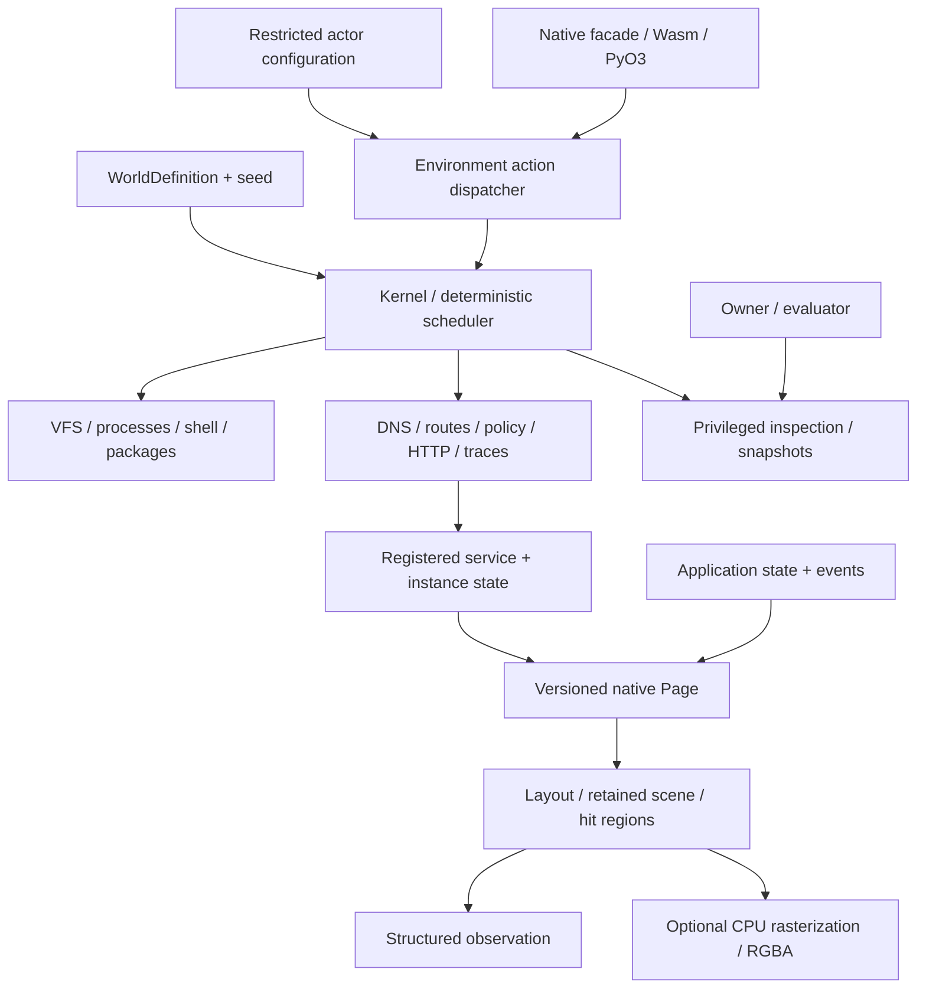

# Runtime architecture

Computerworld has one simulation implementation in Rust. Serialized world data is
input; the company ecosystem is an example package. Neither Python nor JavaScript
reimplements commands, services or rendering semantics.

`cw-protocol` owns portable definitions and envelopes. `cw-sdk` owns trusted
extension traits and registration. `cw-determinism` provides logical clocks,
seeded streams and deterministic scheduling. `cw-computer` and `cw-network` own
machine and communication mechanics. `cw-kernel` coordinates them. `cw-browser`
and `cw-applications` implement application behavior. `cw-scene` and `cw-render`
separate visual description from optional pixels. `cw-environment` projects
actor capabilities and observations; `cw-trajectory` and `cw-evaluation` are
separate recording and evaluation surfaces. `cw-services` holds the shared service
runtime that the `services/*` crates build on. `cw-host-adapters` is the only crate
permitted real host I/O and is opt-in behind explicit policy. The `computerworld`
facade is the usual consumer entry point. `cw-wasm` and `cw-python` wrap that
facade.

Three layers must stay distinct:

1. Simulation state describes what exists, including hidden service and machine state.
2. An actor session grants access to selected machines, action families and observation channels.
3. An evaluator owns private objectives and predicates outside actor observations.

An owner handle is privileged. Do not hand it to untrusted actor code and expect
in-process language visibility to enforce a security boundary. Use an actor-only
wrapper or transport exposing the restricted session methods.

The simulator uses explicit stepping instead of a host async runtime. Pure crates
must not read host time, files, network or randomness. Service implementations are
registered code; snapshots serialize their state and module versions, not code.
See [determinism](determinism.md), [networking](networking.md), and
[security](security.md) for the contract and its limits.
