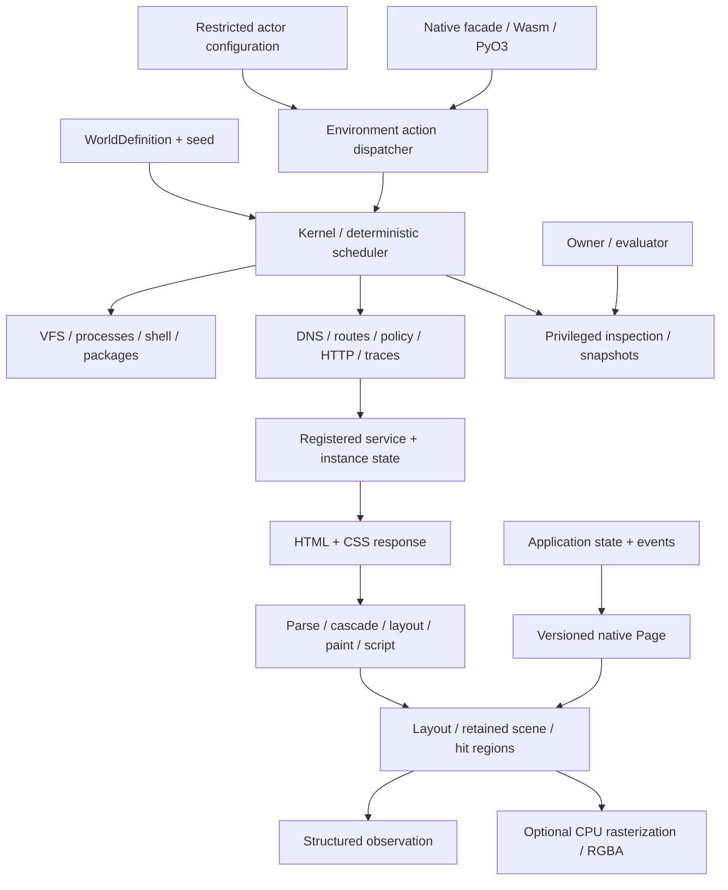

# Runtime architecture

Computerworld has one simulation implementation in Rust. Serialized world data is
input; the company ecosystem is an example package. Neither Python nor JavaScript
reimplements commands, services or rendering semantics.

Two things reach the screen by different routes. A **native application** keeps semantic
state and projects a versioned `Page`, which `cw-scene` lays out directly. A **web page**
arrives as HTML over the synthetic network and goes through `cw-web`: parse, cascade,
layout, paint, script. Both end in one scene, so an observation, a hit test and a frame
do not know which produced it.

## The crates

The workspace groups related packages under `crates/core`, `machines`, `languages`,
`web`, `graphics`, `engines` and `bindings`. Native applications, the service bundle
and the public `computerworld` facade retain their own directories. The root
`Cargo.toml` lists package groups and individual service packages explicitly;
`benchmarks/runner` is also a member. See the [workspace map](../crates/README.md)
for package names and locations. Directory groups are navigation boundaries, not
additional crates.

**Spine (`crates/core/`).** `cw-protocol` owns portable definitions and envelopes. `cw-sdk` owns trusted
extension traits and registration. `cw-determinism` provides logical clocks, seeded
streams and deterministic scheduling. `cw-kernel` coordinates the rest. `cw-environment`
projects actor capabilities and observations; `cw-trajectory` and `cw-evaluation` are
separate recording and evaluation surfaces.

**Machines and the network (`crates/machines/`, `crates/services/`).** `cw-computer` and `cw-network` own machine and
communication mechanics. `cw-service-common` holds the shared service runtime that the
site crates build on, and `cw-services` re-exports all of them as one bundle. `cw-host-adapters`
is the only crate permitted real host I/O and is opt-in behind explicit policy.

**The browser (`crates/web/`).** `cw-web` is the web engine: an HTML 5 tokenizer and tree builder, a CSS
Syntax 3 parser and Selectors 4 matcher, a cascade over one table of 124 longhands,
layout in app units (block, inline, tables, floats, positioned boxes, scroll containers,
flex and grid), paint in CSS painting order, and the DOM, CSSOM, event loop and `fetch`
that a page's own scripts run against. `crates/web/engine/DESIGN.md` fixes the interfaces its
modules meet at. `cw-browser` is the browser around it — tabs, history, cookies, storage,
the omnibox — and keeps `cw_web::page::to_document` as the bridge for a site still served
in the old `Page` format.

**Language runtimes (`crates/languages/`).** `cw-pyvm` and `cw-jsvm` are the Python 3 and JavaScript
interpreters a machine's `python3` and `node` run on, and the ones the browser's script
layer uses; `cw-script-host` is the capability surface they see of a computer.
`cw-regex`, `cw-tz` and `cw-zlib` are the deterministic pieces those runtimes need
(regular expressions in both syntaxes, an IANA time-zone subset, and byte-exact
deflate/inflate/gzip/brotli).

**Applications and their engines (`crates/applications/`, `crates/engines/`).** `cw-applications` implements the native application
behaviour, and the exact engines behind the professional tools are their own pure crates:
`cw-cad` (constraint solver, CSG solids, Part Design), `cw-eda` (schematic capture, SPICE,
PCB layout), `cw-sheet` (the spreadsheet, with XLSX/ODS/CSV), `cw-sql` (a SQLite-format
SQL engine), `cw-raster` (layered image editing) and `cw-video` (the video pipeline).

**Drawing (`crates/graphics/`).** `cw-scene` and `cw-render` separate visual description from optional pixels;
`cw-artwork` and `cw-map` are the zero-dependency generators behind cover art and street
maps, shared by sites and native apps.

**Entry points (`crates/computerworld/`, `crates/bindings/`).** The `computerworld` facade is the usual consumer entry point. `cw-wasm`
and `cw-python` wrap that facade.

Three layers must stay distinct:

1. Simulation state describes what exists, including hidden service and machine state.
2. An actor session grants access to selected machines, action families and observation channels.
3. An evaluator owns private objectives and predicates outside actor observations.

An owner handle is privileged. Do not hand it to untrusted actor code and expect
in-process language visibility to enforce a security boundary. Use an actor-only
wrapper or transport exposing the restricted session methods.

The simulator uses explicit stepping instead of a host async runtime. Pure crates
must not read host time, files, network or randomness. Service implementations are
registered code; snapshots serialize their state and module versions, not code.
See [determinism](determinism.md), [networking](networking.md), and
[security](security.md) for the contract and its limits.

What each of these boundaries costs at run time is [performance](performance.md); what
they are allowed to reach is [security](security.md); and how a version of the whole
workspace is built and compared across platforms is [releasing](releasing.md).
