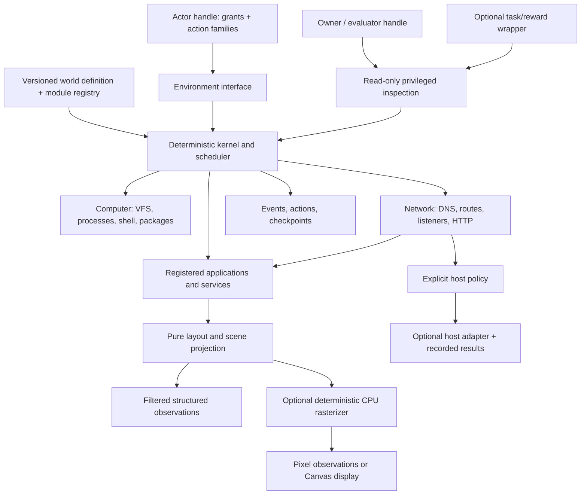

# Architecture proposal — approved

Approved by the user on 2026-09-17. This preserves the phase-2 design; current APIs and verified limitations are documented in the implementation guides. Read the [provenance matrix](../provenance.md)
first. The proposed repository/package working name is **computerworld**. No
registry name or remote repository has been reserved.

## Constraints derived from the investigation

1. Exactly one Rust semantic runtime, persistent in-process, shared by native,
   browser Wasm, Node Wasm and Python bindings. No Node bridge for Python.
2. The default runtime must execute with no host filesystem, socket, subprocess,
   thread, timer, entropy or browser dependency. `std` is acceptable on
   `wasm32-unknown-unknown`; `no_std` is not a requirement. Host effects require
   explicitly supplied adapters and policy.
3. A versioned world definition supplies machines, identities, topology, profiles,
   instances, packages and initial data. The kernel knows no reference company,
   product catalog, website domain, benchmark, reward, TCN type or policy model.
4. All clients of a service share its authoritative state through the network.
   A browser page, API result and local app may differ in presentation, never in
   the underlying service facts. Rendering cannot mutate those facts.
5. Simulation, actor interfaces and evaluation are separate contracts. Full
   state is an evaluator/owner capability, not an observation format by default.
6. Deterministic execution includes initialization, IDs, clock, pending work,
   network timing and browser state. Seeded network jitter alone is insufficient.
7. Performance comparisons must include the same useful work. Existing browser
   startup, sleeps/video and Python-to-Node reconstruction costs are distinct
   from renderer costs.

## Three plausible architectures

| Option | Strengths | Costs / risks | Decision |
|---|---|---|---|
| Universal ECS with dynamic components and ordered systems | Compact batches and entity iteration; flexible machine/app assembly | Harder service-owned invariants, erased state codecs, hidden ordering dependencies; premature ECS design before measured entity workloads | Keep typed/generational IDs and packed tables where useful; do not make ECS the public world model |
| Typed subsystem state machines, one deterministic scheduler, explicit effects and registered modules | Clear ownership; pure transitions; native/Wasm parity; easy checkpoints and capability boundaries; independently implementable crates | Requires disciplined state codecs and effect ordering; some cross-subsystem operations need explicit transactions | **Recommend** |
| Each OS/app/service as isolated Wasm components or processes behind RPC | Strong plugin boundaries; potentially untrusted extensions | Serialization/instantiation overhead, nested-Wasm/browser complexity, callback and replay policy; processes cannot be canonical browser semantics | Later optional adapter/extension host, not initial architecture |

## Recommended structure

The scheduler commits one ordered transition at a time. A subsystem receives a
typed input and explicit context, updates only its owned state, and emits typed
effects. Effects schedule further work; they do not recursively call host services.
Many independent worlds can run concurrently in caller-owned workers/processes.
One world's semantics never depend on that external scheduling.



### Cargo workspace and dependency direction

```text
crates/
  protocol/          versioned data contracts, IDs, errors, topology, effects
  determinism/       logical clock, named RNG streams, stable ID allocation
  scene/             compact scene/layout/semantic contracts; no rasterizer
  sdk/               typed app/service registration, contexts and state codecs
  computer/          VFS, processes, shell grammar and program state machines
  network/           synthetic DNS, routes, listeners, transport, HTTP, policy
  kernel/            scheduler, world transactions, module dispatch, checkpoints
  trajectory/        journal codecs, hash chain, replay runner/checkpoint envelope
  render/            layout engine, hit tests, glyph cache, CPU rasterizer
  browser/           synthetic browser application and native page interpreter
  applications/      optional terminal, files, editor, desktop and client apps
  services/          optional built-in service composition/reexports
  environment/       actor grants, pluggable action/observation adapters
  evaluation/        optional task/predicate/reward wrapper; never a kernel dep
  computerworld/     ergonomic owner/actor facade and selected default modules
  wasm/              wasm-bindgen classes and typed JS object conversion
  python/            PyO3 extension, maturin metadata and thin Python package
  host-adapters/     optional outbound/storage adapters, excluded by default
services/
  mail/ chat/ docs/ calendar/ git/ issues/ static-site/  separate optional crates
worlds/
  company-2026/      definition, fixtures, asset hashes, examples; no kernel import
examples/
  native/ python/ browser/ custom-service/ custom-app/ custom-world/
benchmarks/          Rust workloads, browser comparison runner, result manifests
docs/ research/     contracts, tutorials, provenance, evidence
```

`protocol`, `determinism` and `scene` are leaves. `sdk` depends on these leaves;
`computer`/`network` depend on protocol/determinism, not kernel. `kernel` depends
on computer/network/sdk and contains no concrete app/service registrations.
App/service crates implement the SDK and are registered by the owner/facade;
kernel never depends on them. Browser is one such app. Render consumes scene
contracts, not kernel internals. Environment adds actor interfaces above kernel;
its rasterization dependency is feature-gated. Trajectory tooling consumes kernel
and protocol; kernel emits protocol events to a sink without depending on tooling.
Evaluation depends on owner/inspector interfaces, never the reverse.

The directories are ownership boundaries; tiny crates can be combined only if
doing so preserves this acyclic dependency graph. Separate service crates enable
small browser bundles. A facade feature selects useful defaults without baking
them into the kernel.

### Contracts to freeze first

- World schema major/minor, canonical encoding rules, typed IDs, logical ticks,
  seed representation, errors and deterministic budget exhaustion.
- `WorldDefinition`: immutable profiles/assets, computers/users, network zones,
  links/interfaces/routes/DNS, service placements, module instances and initial
  state. Unknown required kinds/versions fail validation; no invented defaults.
- `ModuleKey { namespace, name, version }`, `StateCodec`, typed transition,
  namespaced effect, ordered emitted events and scoped context.
- `RequestId`, HTTP byte body/status/header semantics, typed network outcomes,
  caller identity, listener ownership and host-effect records.
- Scene version, stable node/interaction IDs, fixed-point geometry, semantic
  roles, ordered primitives, revisioned patches and damage rectangles.
- Actor capability grants, versioned action-family envelope, observation channel
  descriptors and typed step result. Privileged data has separate response types.

Use serde at serialized boundaries, not a JSON round-trip on every internal step.
Typed module state lives in memory behind a registry vtable with explicit codec,
clone/fork and version hooks. The registry is immutable shared code/metadata;
checkpoints contain module keys and state, never closures or Rust pointers.
Unknown codecs fail restore before mutating a live world. All semantic mutations
go through scoped transactions; handlers cannot obtain `&mut World`.

First-party Rust modules are trusted code. Rust traits cannot stop malicious native
plugins from calling host APIs. The default build uses audited pure modules and
dependency/import checks; untrusted actors/extensions need an actual isolation
boundary. Do not claim an in-process API is a security sandbox.

### Deterministic state and execution

Use integer microsecond ticks with checked arithmetic. The scheduler key is
`(due_tick, phase, insertion_sequence)`; phases and effect enumeration order are
versioned. Actor batches are supplied in an ordered vector by a coordinator;
remote wall-clock arrival is not an implicit tie-break. Scheduling into the past
is rejected. A bounded `step` drains work to a declared quiescence/time boundary,
returning pending operations when needed. Event/instruction budgets prevent
zero-time loops and are independent of elapsed wall time.

Use a specified PRNG algorithm with golden vectors, independent named streams
derived from `(seed, stable instance ID, purpose, algorithm version)`, and
world-local counters. Do not inherit a crate's unspecified default RNG. New
unrelated service instances must not perturb existing streams. Seeded variation
must be explicit in blueprint generators, not random cosmetic IDs alone.

Checkpoint state includes clock, RNG stream positions, ID/generation counters,
scheduler queue, computers/inodes/blobs/process program counters/fds, network
connections/buffers/cache expiry, service/module state, browser tabs/history/
storage/pending navigation, actor sessions, input focus and pending effects.
Ownership is explicit: kernel checkpoints contain simulation/module/process
continuations and deterministic budget/error state; environment checkpoints contain
actor adapter sessions, observation cursors and grants. The owner facade atomically
aggregates both at a scheduler boundary. Input focus belongs to the relevant app's
canonical state. A kernel-only checkpoint is not advertised as a whole environment
checkpoint. Restore publishes the aggregate only after validating every section.
No wall times, addresses, host paths or cache-only renderer data enter the
semantic hash. Restore and fork preserve future behavior, including mid-request.

Start with shared immutable blueprints/assets and copy-on-write subsystem roots;
share file blobs and service records independently. Do not copy the whole world
for a single file mutation. Measure first-write cost and retained memory as well
as snapshot time. Move high-churn tables to paged COW/arenas only when profiles
justify it. No manual reference counting or bespoke persistent collection is
required before measurement.

Portable checkpoints serialize reachable state in a canonical, versioned form
with engine/module/font/world content hashes. BTree ordering/canonical map sorting,
defined byte encoding and integer time avoid map-order/float ambiguities. Restoring
with incompatible schema/modules is an explicit error or declared migration.
Fast in-process snapshots are opaque shared roots; export is a separate O(state)
operation. Renderer caches are discarded/reconstructed after restore.
Portable export includes required asset/font/initial-state blobs, or requires a
caller-provided verified offline blob pack. Hashes alone are not sufficient for
self-contained restore. Native, browser Wasm and Python must exchange checkpoint
bytes and reproduce subsequent semantic hashes.

Replay starts from a verified definition/checkpoint and re-executes ordered inputs,
checking event/state hashes. Log input commands, emitted causal events and external
adapter results separately: not every observation is an input and not every trace
is sufficient to restore state. A replayed host effect consumes its recorded result;
it never reissues a real request. Live host access is not promised reproducible
without that result log. Logical time controls animation; observe/render is pure.
An in-flight live host operation is not a reproducible continuation: portable
snapshot/fork returns `ExternalEffectPending` until it has a recorded completion.
Restoring an older checkpoint detaches outstanding adapter tokens, rejects stale
completions by generation and never reissues them. An already sent real request
cannot be undone; this limitation is confined to explicitly enabled host mode.

### Computer semantics

VFS stores bytes and inodes, never host paths. Profiles choose path syntax,
case sensitivity, roots, user homes, command dialect, initial services and package
providers. Preserve inode/link/rename/permission regressions from SCE. Permission
checks use explicit user/process credentials; per-machine disk and PID spaces are
isolated unless a declared network protocol shares data.

Processes are scheduled synthetic programs, not host subprocesses. Program state,
stdin/out/err, pipes, signals, waits and owned listeners are explicit resumable
state. Exiting a process releases its resources. A shell parses supported syntax
and invokes registered programs against the same VFS/network used by apps. POSIX
and PowerShell are documented subsets; unsupported behavior returns an honest
error rather than a success-shaped fixture. Packages install executable/app
descriptors with versioned dependencies and transactional state changes.

Git keeps object/tree/commit/ref/index/worktree semantics and remote push/fetch
through the synthetic network. Start from SCE's behavioral coverage, use binary
storage, and state explicitly where the protocol is a synthetic Git API rather
than wire-compatible smart HTTP. A reference task must clone/push/fetch real shared
objects; GitHub-like UI counters alone do not satisfy it.

### Network, services and browser

The first-class zones are synthetic local, synthetic internet and host outbound.
Nodes have interface addresses, links/routes and service-owned endpoints. DNS
lookup itself has a source node, reachable resolver, records/cache/TTL and a trace.
Unknown names fail synthetic DNS. They never fall through to host DNS.

Navigation follows `URL -> DNS -> route/policy -> connection/listener -> HTTP ->
service transition -> response -> browser state -> page/layout/scene`. A service
placement references a node/listener, not a browser/OS. Shared implementations can
have many isolated instance states. Services can send mail/call peers only through
scheduled network effects, preserving topology consequences.

Retain connect/refuse/timeout/close, listener ownership, stream/datagram semantics
where useful, bounded buffers and inspectable traces. Do not implement Ethernet,
CPU emulation or packet detail with no effect on the workload. Latency/loss profiles
and connection ordering are deterministic; detailed packet tracing is selectable
without changing semantics. Mandatory replay events cannot be disabled with tracing.

Host requests require both a grant/policy and an adapter. Authorization covers
source principal, scheme, hostname, port, every resolved address and every redirect;
the adapter pins the authorized address and enforces byte/time budgets. Default
Wasm exports no fetch import. Explicit host mode returns an external-effect token
to an owner-supplied adapter and records completion order/results.

The synthetic browser owns URL parsing, tabs, history, storage/cookies scoped by
origin, redirects/forms, focus/scroll and pending navigation. It interprets a
versioned native page/media type, plain text and selected asset formats. Page
interactions issue semantic local events or HTTP requests; they cannot embed
arbitrary host JavaScript. Loading images/linked content uses the same network and
origin rules. Pages render only received response data or browser-local state,
never a borrowed service backing store; topology, authorization and latency must
also govern what is displayed. Byte/network errors remain visible errors. A registered static-site
package can intentionally serve a fallback page; the network cannot fabricate one.

HTML/CSS/JS execution is an optional compatibility adapter with explicit state,
network and determinism limitations. It is excluded from the offline Wasm build.
It must not silently become a second implementation of synthetic services. Full
Chromium checkpoint/replay parity is outside the canonical contract.

### Rendering contract and implementation choice

Use a **compact retained scene with explicit patches**, produced by pure app/page
projection. Immediate scene construction remains convenient for simple apps, but
stable node IDs let the renderer reuse layout, glyphs and unchanged tiles. This
avoids conventional DOM reconciliation and CSS style resolution while retaining
incremental updates and hit testing.

The scene has ordered layers, clips/transforms, boxes/borders, shaped text runs,
image assets and bounded path commands. Use structure-of-arrays/packed ranges where
benchmarks support them, intern repeated assets/styles, and fixed-point logical
coordinates. Layout offers explicit rectangles plus small row/column/stack/scroll
containers and text wrapping. It is not an HTML/CSS emulator.

Keep three related outputs distinct: visual primitives, interaction regions and
a semantic tree (role/name/value/state/relations/bounds). A button's stable
interaction ID connects all three. Hit testing applies inverse transforms, clips,
z-order and pointer capture against the same geometry used for pixels. Stale
revision references have an explicit reject/re-resolve rule. Keyboard focus, IME
text events and selection belong to app/input state, not DOM side effects.

Structured observation may request semantic-only or semantic+layout+scene deltas;
neither invokes rasterization. Pixel observation requests a viewport/DPR/format
and rasterizes only required dirty tiles, reusing buffers. Damage includes both
old and new bounds, translucent overlap and changed clips; correctness precedes
incrementality. Cache budgets prevent thousands of worlds retaining full screens.

Text uses packaged, licensed, content-hashed fonts, explicit fallback and pinned
shaping/raster algorithms; never host-installed fonts. Candidate evaluation is
custom box/tile compositor plus rustybuzz/fontdue for text, with tiny-skia as an
optional path rasterizer. These are candidates, not yet measured dependency
choices. Compare bundle size, memory, glyph shaping and native/Wasm pixel equality
before freezing them. Avoid floating-point semantic state; any raster arithmetic
must have deterministic rounding and cross-target tests. If a candidate fails
byte-identical native/Wasm fixtures, do not silently weaken the rendering contract.

Canvas only displays canonical RGBA bytes and forwards input. A GPU preview may
later consume scenes, explicitly separate from canonical pixel observations.
Accessibility DOM mirroring is optional visualization infrastructure and never
required for layout or actor observations. Images/fonts are packaged; the demo
needs no backend after static assets load and makes zero episode network requests.

### Agent interfaces and evaluation

`EnvironmentConfig` declares actor identity, machine/session grants, action families,
observation channels, resource budgets and reset authority. Families such as
`terminal.v1`, `filesystem.v1`, `pointer.v1`, `keyboard.v1`, `browser.v1` and
`http.v1` register their schema/validator/translator. Adding a family does not
change a giant kernel-facing public action enum. Internal effects may be typed
enums; external extensibility is not unrestricted arbitrary JSON execution.

Observation projection filters by actor, scope and availability before
serialization, including error/info fields. Observations reflect current permitted
state, never fabricated success or an echo of requested action arguments. A terminal may legitimately print a
secret it is permitted to read; the interface does not magically redact world
content. Private task answers/predicates never enter public instructions or info.
Untrusted policies receive only actor endpoints/serialized observations. Owners
choose whether a structured interface intentionally exposes semantic information.

An evaluator handle performs side-effect-free queries without actor events or
changes to RNG/time. An optional evaluation wrapper owns objectives, rewards,
termination predicates and curricula. Base `StepResult` reports observations,
action outcomes, logical time, pending work and runtime status; no mandatory reward.
Task wrappers add reward/termination separately. Multi-agent clients share one
world/coordinator with independent grants, views and user identities.

Reset replaces owned episode state; an arbitrary actor cannot reset other agents'
world. Owner snapshot/export/fork APIs expose full state. An actor-level snapshot
method, if enabled, returns an opaque handle scoped to that actor's authority,
never full checkpoint bytes. Local Python/native object boundaries prevent
accidental leakage, not memory inspection by hostile code in the owner process.

## Proposed public APIs

Illustrative signatures and usage; these are reviewable contracts, not runnable code.

```rust
let definition = WorldDefinition::from_json(bytes)?;
let registry = Registry::new().with_standard_modules();
let mut world = World::create(definition, Seed::from_u64(7), registry)?;
let actor = world.environment(EnvironmentConfig::desktop("alice", "mac"))?;
let obs = world.observe(actor, ObservationRequest::structured())?;
let step = world.step(actor, &[Action::new("browser.v1", navigate)])?;
let frame = world.render(actor, RenderRequest::rgba(1280, 720))?;
let checkpoint = world.snapshot();             // owner, cheap COW root
let fork = world.fork(&checkpoint)?;
let exported = checkpoint.encode()?;           // owner, complete portable state
let events = world.trajectory_since(cursor)?;  // owner trace, filter for actor
let evaluator = world.inspector();             // owner-only read interface
world.restore(&checkpoint)?;
world.reset(Seed::from_u64(7))?;
```

Rust owner API uses handles and `&mut World` to make ordering explicit. The facade
may expose an actor session with interior ownership, but no duplicate runtime is
created by making a session.

```javascript
import init, { createWorld } from '@computerworld/wasm';
await init();
const world = createWorld(definition, { seed: '7' });
const env = world.environment({ actor: 'alice', machines: ['mac'],
  actions: ['browser.v1', 'pointer.v1', 'keyboard.v1'],
  observations: ['semantic.v1', 'pixels.v1'] });
const obs = env.observe({ structured: true });
const result = env.step([{ family: 'browser.v1', op: 'navigate',
  machine: 'mac', url: 'https://docs.company.test/handbook' }]);
const frame = env.render({ width: 1280, height: 720 }); // Uint8Array RGBA
const checkpoint = world.snapshot();
const branch = world.fork(checkpoint);
const journal = world.trajectory({ since: 0 });
world.reset({ seed: '7' });
```

Wasm-bindgen supplies ergonomic objects/classes and generated TypeScript types;
serde-wasm-bindgen is a candidate for structured conversion. Define u64 handling
explicitly (decimal strings/BigInt, never lossy JS Number). Pixel buffers have
documented lifetimes; default copied output is safe across calls, optional leased
views can follow profiling. Node initially uses this same Wasm package. Native
N-API is optional only if measured overhead justifies another thin binding.

```python
from computerworld import World

world = World(definition, seed=7)
env = world.environment(actor="alice", machines=["ubuntu"],
                        actions=["terminal.v1"], observations=["terminal.v1"])
obs = env.observe()
result = env.step([{"family": "terminal.v1", "op": "execute",
                    "machine": "ubuntu", "command": "cat ~/notes.txt"}])
checkpoint = world.snapshot()
branch = world.fork(checkpoint)
world.restore(checkpoint)
```

PyO3/maturin creates native wheels; Python owns no simulation semantics. Release
the GIL for safe Rust stepping/rendering when feasible, and batch actions/worlds
without invoking Python callbacks inside deterministic transitions. Explicit
state serialization also supports a future C ABI or worker transport; Rust struct
layout is not a stable ABI. New consumers need adapters, not simulator rewrites.

## Reference ecosystem and compatibility

Ship an external company blueprint with macOS/Windows/Ubuntu workstations, a
second employee, Ubuntu server, Git host, mail/docs/chat/calendar/issues services,
an internal subnet and synthetic public sites. Users/groups, applications and
cross-service references are validated data. Domain names under `.test` avoid
confusing actual destinations; branding is optional. Seeded variation changes
declared data such as assignments/messages with reproducible foreign references.

Examples cover local read/derive/write, cross-machine Git, internal navigation,
mail-to-document work, shared editing, process/listener debugging, multi-user chat,
and browser-discovered information. Every example succeeds through actor actions,
with assertions outside the actor. A separate minimal custom world with unknown
product/profile IDs proves the kernel is generic. Task definitions live outside
simulation crates and are examples, not a new benchmark suite.

Compatibility is behavioral, not a promise to accept every prior snapshot or
pixel image. Port selected predecessor fixtures/tests with an explicit support
ledger: preserved, corrected, replaced, deferred. Use current SCE mechanics, TCN
session/clock/probe fixes, SynthUX domain stores and mock view schemas. Do not
carry global Date/UUID patches, host-file-backed state, subprocess-per-step,
hardcoded seed imports, grammar/model algebra, fake-success operations, implicit
outbound fetch, product catalogs or browser selectors into the core.

## Dependency sources reviewed

These official references establish available binding/raster APIs, not proof of
our eventual portability/performance: [wasm-bindgen guide](https://wasm-bindgen.github.io/wasm-bindgen/),
[PyO3 guide](https://pyo3.rs/), [maturin guide](https://www.maturin.rs/),
[rustybuzz](https://docs.rs/rustybuzz/latest/rustybuzz/),
[fontdue](https://docs.rs/fontdue/latest/fontdue/),
[tiny-skia](https://docs.rs/tiny-skia/latest/tiny_skia/).
Pin audited versions and feature sets during implementation. No Tokio in pure
crates; async host adapters are optional and cannot choose semantic event order.

See the [parallel implementation and verification plan](implementation-plan.md)
for ownership, contract gates, benchmarks and the approval scope.
