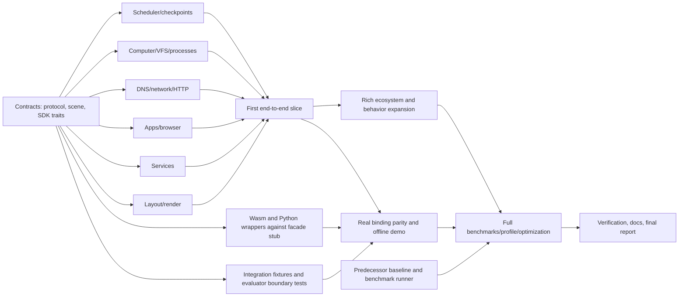

# Parallel implementation and verification plan

Status: approved on 2026-09-17; parallel implementation and verification in progress. The
[architecture proposal](architecture-proposal.md) defines ownership and semantics.
The user approved full implementation after the phase-2 review. The milestones below are the acceptance plan, not a claim that each has already passed.

## Integration order and dependency DAG

The goal is minimum elapsed time with frequent integration, not one subsystem
finished in isolation before anyone else starts. Freeze small interfaces first;
allow typed stubs/contract fixtures for independent work while those interfaces
stabilize. Stubs may unblock development but cannot count as working features.

Documentation, baseline capture and test specification begin alongside contracts.
Wasm compile checks begin with the first pure crate; bindings do not wait for rich
services. The root integration steward owns root manifests, facade exports, shared
CI and interface-change coordination. Each arm owns its files and tests; an
interface change is proposed to its owner and integrated once, not edited by
several agents at once. Commits remain small and buildable where feasible.

### Arms to dispatch after approval

| Arm / owned area | Inputs | Promised outputs | Tests | Can start before dependencies finish? | Integration point |
|---|---|---|---|---|---|
| A. Protocol / `crates/protocol` and schema fixtures | Approved schema and version policy | Validated generic definitions, IDs, effects, stable encodings and errors | Round-trip/canonicalization, invalid topology/unknown kinds, golden vectors | Immediately | Contract freeze; all arms import one crate |
| B. Determinism/kernel / `determinism`, `kernel` | A + SDK signatures | Clock/RNG/ID state, scheduler, transactions, kernel snapshot/restore, typed registry dispatch | Stable ordering, budgets, RNG independence, mid-event restore, fork isolation | Immediately with fake computer/network/module handlers | First slice orchestrator |
| C. Computer / `computer` | A and context/effect signatures | VFS, process programs, shell, packages, local Git state | SCE regression ports, property tests, isolation, restart/listener cleanup | Immediately against context stubs | Terminal and network commands into slice |
| D. Network / `network` | A + scheduler effect signatures | Source-aware DNS/routing, streams/datagrams/HTTP, gateway decisions, trace records | DNS expiry, loopback, denied routes, listener ownership, redirect/rebinding policy | Immediately with fake service handler and logical queue | Real request path into slice |
| E. Renderer / `scene`, `render` after scene contract freeze | Scene/input contracts and fixture views | Layout, compact scenes, patches, hit tests, deterministic text/CPU raster | Golden frames native/Wasm, clip/transform hit tests, incremental=full render | Immediately with static scenes | Browser/app scenes, optional pixel channel |
| F. SDK/apps/browser / `sdk`, `browser`, `applications` | A + scene contracts + network request/effect signature | Registration codecs; stateful terminal/editor/desktop/browser; page descriptions | App events, URL/history/storage/forms, stale response/refresh, view purity | SDK trait skeleton first; then mocked responses | Same network response drives rendered state |
| G1. Communication/docs / service mail/chat/docs crates | SDK/service contract, actor identity | Per-instance delivery, membership, messages and document revisions | Multi-user auth, shared mutations, no render mutation, restore | Immediately with service harness | Two clients observe same backend |
| G2. Git/issues / service git/issues crates | SDK + C Git objects/protocol | Remote objects, push/fetch, issues/comments/review state | Clone/push/fetch parity, rejection, issue transitions, cross-client state | Workflow and request fixtures now; object adapter later | Cross-machine Git example |
| G3. Calendar/static sites / corresponding service crates | SDK + deterministic time/page contract | Calendar events/RSVP and small static/API site | Fixed timezone, validation, seeded fixtures, cross-origin links | Immediately | Browser navigation slice and ecosystem |
| H. Wasm/JS / `wasm`, `examples/browser` | Facade signature and generated schema types | Ergonomic JS package, Node entry, offline Canvas demo | Browser Wasm execution, zero episode requests, input/frame parity | Immediately with test facade; compile pure crates early | Real runtime as soon as slice passes |
| I. Python / `python`, `examples/python` | Same facade signature | PyO3 classes, maturin wheel, Python API/examples | Install wheel, drive Rust state, reset/fork/checkpoint parity, no Node dependency | Immediately with test facade | Real runtime and parity corpus |
| J. Environment/trajectory/evaluation / corresponding crates | A + kernel owner interface | Action families, observation projection, inspector/task wrapper, journal/replay | Actor capability tests, poisoned evaluator data, replay hashes, projection purity | Immediately against fake kernel; tests first | Actor→kernel→observation→trajectory slice |
| K. Worlds/examples / `worlds`, native/custom examples | World schema + service identities | Rich company blueprint plus unrelated minimal world and examples | Foreign-reference validation, no hidden kernel defaults, actor-only solutions | Immediately with definitions/expected transcripts | Slice then progressively richer services |
| L. Benchmarks / `benchmarks` | Pinned predecessor sources, scene/workload contract | Reproducible runners, raw data, p50/p95, memory/bundle/profile reports | Same-work assertions, timing sanity, no-op detection | Immediately; predecessor baseline independent | Measure slice early, full suite later |
| M. Documentation / `docs`, usage README sections | Approved contracts and actual arm outputs | Tutorials/SDK docs/contracts/migration ledger | Link/schema/example checks, execute examples with CI | Immediately; mark proposed until runnable | Continuous updates; final evidence report |

This is at most fifteen arms plus the integration steward. Short contract arms
finish early and their agents can move to tests/review; avoid creating more active
agents than the environment supports. Service arms own distinct crates. Renderer
owns scene code after initial consensus; SDK owner owns SDK code. Integration
steward alone edits root Cargo feature/dependency wiring during concurrent work.

## Milestones and stop conditions

**M0 — contracts and portability scaffold.** After approval, create the workspace,
pin dependencies, define errors/IDs/seed/ticks/world schema and SDK/scene fixtures.
Native and `wasm32-unknown-unknown` compile checks run immediately. No simulation
dependency can pull in an async host runtime or implicit network backend. Baseline
capture and binding packaging proceed concurrently.

**M1 — smallest truthful vertical slice.** A serialized custom world instantiates
two computers and one service. An actor launches the browser, navigates through
source-aware DNS/routing/HTTP, receives a native page, clicks a hit-tested control,
mutates service state and sees a second computer observe that mutation on refresh.
The same run produces structured observations, optional RGBA, causal events and
a complete restore/replay check. A terminal inspects a local file. No product
names or seeds are hidden in the kernel. This is the first integration target,
not a polished reference desktop.

**M2 — parity and expansion.** Run that slice through native, browser Wasm and a
built Python wheel. In parallel add the richer VFS/shell/process/package/Git
behavior, additional services and company world. Integrate each arm when its
contract tests pass; do not wait for all service features before testing bindings.

**M3 — full semantics and performance.** All required behavior gates pass, examples
run using actor interfaces, profiling identifies actual bottlenecks, improvements
are measured against pre-optimization results. Keep raw data and semantic/frame
hashes so an optimization cannot silently change the workload.

**M4 — final delivery.** Run complete relevant suites, native examples, Python wheel
examples, browser demo with network blocked after asset loading, benchmark matrix
and documentation examples. Report preserved/redesigned/dropped features,
downstream fixes, compatibility, bundle characteristics, results and limitations.
Do not label compilation as Wasm execution or import success as binding parity.

## Behavioral acceptance matrix

| Requirement | Required evidence |
|---|---|
| Multiple computers/OSes | Mac/Windows/Ubuntu profiles and an unrelated custom profile; separate files, PIDs, users and listeners |
| Files/processes/shell/packages | Meaningful regression cases from SCE, binary files/links/rename, pipes/exit cleanup, install affects launch/command resolution |
| Two computers communicate | One starts/binds a service and the other reaches it through configured DNS and routes |
| DNS + virtual HTTP | Resolver reachability, TTL expiry, missing name, status/headers/bytes, causal request/response traces |
| Synthetic browser uses network | Observe DNS/network/service events from actual navigation; removing route/listener changes displayed outcome |
| Persistent service mutation | A writes through HTTP, B reads after refresh; stale B view does not magically bypass latency/cache/network |
| Git across machines | Commit/push on A; fetch/clone on B yields same objects and file content, separate worktrees |
| Unauthorized/outbound blocked | Missing grant, denied route, host policy without adapter and adapter without policy all fail; no ambient host fallback |
| Deterministic replay | Same engine/modules/definition/seed/input log gives identical semantic events and state hashes native/Wasm/Python |
| Different seeds | Declared initialized world fields differ, while every reference remains valid; identical seed reconstructs exactly |
| Snapshot/restore/fork | Resume mid-DNS/HTTP/process wait; branch edits do not affect original; export/import across bindings reproduces suffix |
| Actor/evaluator isolation | Actor types/payloads omit private state, probes and answer keys; changing hidden evaluator answers cannot change actor view or allowed state |
| Inspection purity | Repeated evaluate/observe does not move time, consume RNG, change state or add actor events |
| Extensible interfaces | Terminal-only, filesystem, GUI, browser-only, HTTP/tools and multi-agent configurations from same kernel; custom action family |
| Trajectory/network inspection | Stable causal IDs connect action, DNS, request, service mutation and response; actor trace filtering enforced |
| Rendering/hit tests | Direct app scene renders and receives keyboard/pointer; clips/transforms/z-order/focus; identical seed/frame native/Wasm |
| Structured without pixels | Instrumented raster call count stays zero for structured-only episodes |
| Incremental correctness | Full rebuild and incremental dirty-tile render agree after random supported edits, clipping and scroll |
| Offline browser demo | Static packaged assets only; block all later requests; execute full workflow with no backend/Node/server semantics |
| Python same runtime | Install built wheel in fresh venv with Node absent from PATH; replay shared corpus and export matching state/checkpoint |
| Custom worlds/services/apps | Examples register new IDs/state codecs without kernel edits or importing reference-world data |

Property tests target VFS path/inode invariants, canonical serialization,
scheduler order, RNG stream independence, network authorization monotonicity,
scene patch equivalence, and fork isolation. Minimized failing seeds become fixed
regressions. Avoid tests that merely restate a trivial field assignment.

## Benchmark methodology

Run release builds and record engine/predecessor commits, dependency locks, compiler,
flags, OS/CPU/core affinity, browser version, viewport/DPR, font/asset hashes,
world/seed/action hashes, tracing level and cache policy. Pin heterogeneous CPU
class/affinity when possible; the investigation host is ARM64 with mixed cores.
Do not mix unrelated concurrent builds into benchmark runs. Run latency and
throughput separately; external parallelism is explicit.

For each short workload: warm up, collect at least 1,000 measured operations in
each of five independent runs, report per-run p50/p95 and throughput, sample count
and dispersion. Use fewer expensive cold-start samples only with a stated count
and uncertainty. Batch very fast operations to exceed clock resolution, but do
not mislabel batch averages as individual-operation p95. Report allocations/bytes,
resident or measured heap usage, and retained memory when tooling supports them.

| Workload | Variants / required measures |
|---|---|
| Terminal steps | Persistent `pwd`, parse+pipe, read/write command; no per-step process launch; actor projection measured separately |
| Filesystem | Small/large byte read/write, directory traversal, rename/link, first mutation after fork |
| Network/HTTP | DNS warm/cold, local and synthetic-internet route, GET/POST mutations, latency/loss enabled/disabled, trace cost |
| App interaction | Text edit, selection, button submit, chat/document mutation; assert changed state |
| Browser navigation | Cold/cached synthetic page, redirect, form submission, history; verify same rendered content |
| Structured render | Semantic-only, layout+hit tree, scene full/patch, 1%/10%/100% dirty changes; raster count zero |
| Raster frames | Static/dynamic scenes, text density, scrolling/clips/images, 640×480/1280×720/1920×1080; full vs tiles |
| Reset | Same prepared blueprint, new seed, small vs company world; separate parse/validate/create from reset |
| Snapshot/fork | Snapshot handle, first write, branch chain, portable encode/decode, drop/reclaim and peak memory |
| Many worlds | 1/100/1,000 instances subject to memory; no unbounded frame caches; serial and configured-worker throughput |
| Wasm | Browser execution and Node Wasm, boundary conversion, per-step/batch, linear-memory growth, cold instantiate |
| Python | Native binding overhead, actions batched/unbatched, GIL behavior, no subprocess path |

### Renderer versus predecessor comparison

Use two explicitly separate comparisons:

1. **Matched rendering work.** Pin an existing predecessor HTML/React fixture,
   fonts, dimensions and visible state transitions; author an equivalent native
   scene. Test correctness via semantic content, actual changed service/application
   state, interaction geometry and reviewed images. Do not use SynthUX's
   requested-action echo or unconditional success fields as an oracle. Use a warm
   persistent browser with no arbitrary waits/video or file I/O in the timed region.
2. **Complete existing workflow.** Preserve the old orchestration and separately
   report startup, artificial waits, remote/state bridge, screenshots, encoding,
   video and file output. This measures operational savings, not just rendering.

For the matched comparison report semantic transition, layout/hit testing,
update-to-frame availability, raster/readback and encoding independently where
instrumentation permits. Browser compositor layout/paint timing may require Chrome
tracing; if only screenshot timing is available, label it capture latency rather
than isolated raster cost. Compare raw RGBA paths where available and PNG-to-PNG
end-to-end capture separately; never divide Chromium PNG+screenshot time by Rust
RGBA-only time and call that a renderer speedup.

Include a synthetic primitive/text/scroll benchmark implemented on both DOM and
scene representations to isolate representation cost, as well as actual migrated
predecessor screens for realism. Keep JS/browser-to-Rust Wasm results alongside
native results; native-versus-browser alone confounds representation and runtime.
Disable host network/animation, drive logical timestamps, pin device scale/fonts,
and vary scene size/text density/change fraction. Report cold and warm glyph/cache
states and equal documented memory budgets. Correctness failures invalidate the
corresponding performance result.

Calculate `old_time / new_time` for the *same* metric and workload, with raw sample
data. Proposed performance goal: at least 3× median speedup for matched warmed
dynamic scene update+frame production, with no p95 regression; treat this as a
design target, not a measured result or a reason to omit slow cases. If missed,
profile, optimize and report the actual result and tradeoff. Absolute throughput
budgets will be set against the first reproducible baseline before optimization.

Wasm report includes raw/gzip module and JS sizes, enabled features/services/font
assets, initialization time, warm runtime memory, growth under repeated resets,
single/batched call overhead and native/Wasm hash parity. Bundle size includes
assets rather than hiding fonts outside the accounting. Publish raw results and
machine details with the final report.

## Documentation deliverables

README quickstarts will show install → define world → create owner/actor → step →
observe/render → trajectory → snapshot/fork → reset/replay. Separate documents
cover architecture, world schema, determinism, networking, rendering, service SDK,
application SDK, agent API, Wasm/browser, Python, custom world/service/app,
host isolation, performance methodology and provenance/migration. Examples become
executable checks against packaged artifacts. Proposed APIs in this phase must
not be presented as already available packages.

## Explicit exclusions

No full OS/CPU/TCP/Chromium emulation; no faithful arbitrary PowerShell/POSIX shell
promise; no browser-process-per-world default; no JS/Python semantic forks; no
training/model stack or mandatory reward. Real-browser execution, untrusted plugin
sandboxing, GPU previews, native Node FFI and Gymnasium/PettingZoo wrappers remain
optional extensions, not prerequisites for the requested canonical environment.

## Approval scope

Approval selects the typed-state-machine architecture, scene renderer, crate
boundaries, checkpoint/actor separation and parallel plan above. It authorizes
implementation, local builds/tests/examples and measured optimization in this
standalone repository. Package publication, remote hosting and registry names
are not needed to build and verify it. The next action after approval is contract
freeze plus parallel dispatch, not another investigation phase.
