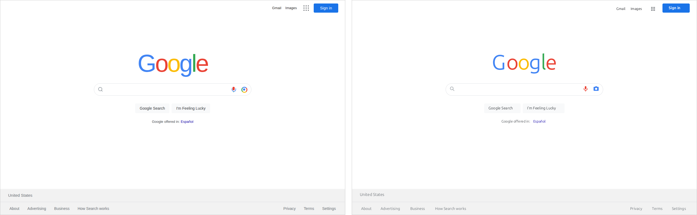
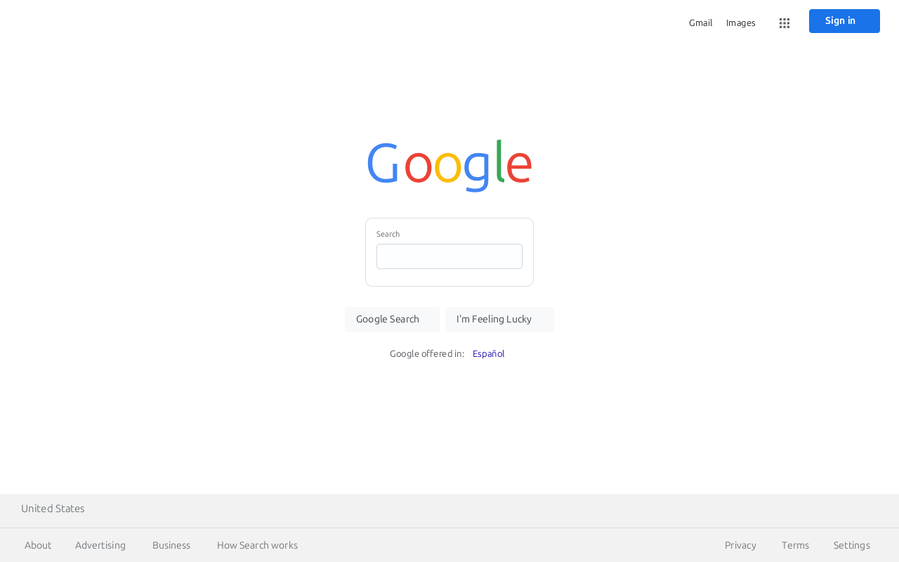

# The Google homepage in the `Page` format: the M0 ceiling test

Milestone 0 of [`docs/contracts/web-engine-plan.md`](../../../docs/contracts/web-engine-plan.md) asks one question in
writing: can `cw_protocol::Page`, authored with maximum care, reproduce the look of the
Google homepage, or is the format itself the ceiling? Everything here is in
[`research/studies/google-ceiling/`](./); nothing in a crate or service was changed.

## What was attempted

1. **A reference.** [`mock.html`](mock.html) is a self-contained HTML+CSS
   mock of the current google.com homepage at 1280x800: header links top right (Gmail,
   Images, the apps grid, the Sign in button), the logo as text in the four Google colours
   (the logo image is not ours), the pill search box with magnifier, mic and lens icons,
   the two grey buttons, the "Google offered in" line, and the full-bleed grey footer with
   the country row and the two link rows. System font stack `arial, sans-serif`; no external
   resources; hover states written as CSS so the table below can say what they are.
   Rendered by Chromium through Playwright (`shot.mjs`, which reuses
   `scripts/dom-to-site/capture.mjs`) to [`chromium.png`](chromium.png), with
   the box tree and ARIA snapshot in `capture.json`.

2. **The same page in the format.** [`page.json`](page.json) is a
   `static-site` service whose `/` is a `Page` using everything the working tree offers:
   a theme, `styled` runs, `row` with `justify` and `align`, fixed-width blank `styled`
   runs as insets, `spacer`s for exact vertical rhythm, a `card` with a transparent-ish
   white fill and a GET `action` for the pill, `icon`s with actions, styled `button`s and
   `link`s, and `pin: "top"` / `pin: "bottom"` rows for the header and footer. It was
   iterated against the renderer's layout code (`crates/web/browser/src/page_scene.rs`), not
   guessed: every height in it was computed from `place`, `row` and `layout_scrolled`.
   Rendered through the in-world browser (the Node Wasm build, freshly rebuilt from the
   working tree) by `render-page.mjs`, which maximises the browser window and sizes the
   desktop so the page pane is exactly 1280x800, to
   [`computerworld.png`](computerworld.png).

3. **A second variant** [`page-form.json`](page-form.json) replaces the
   decorative pill with a real `form` + `input`, so the search box is a genuine textbox
   the actor can type into. Rendered to
   [`computerworld-form.png`](computerworld-form.png). The two variants are
   the honest pair: the format can have the look *or* the control, not both.

4. **Scoring** with `scripts/dom-to-site/compare.mjs` (structure recall of accessible
   names, role agreement, mean-colour similarity over a 64-column grid, grey SSIM), and
   [`side-by-side.png`](side-by-side.png) (Chromium left, computerworld
   right).

## The render pair

The real-textbox variant, for the record:

## The score

| Variant | Names found | Role agreement | Interactive targets | Colour similarity | Grey SSIM | **Fidelity** |
|---|---|---|---|---|---|---|
| `page.json` (decorative pill, card with action) | 17/18 (0.944) | 0.824 | 15 vs 14 | 0.997 | 0.936 | **0.943** |
| `page-form.json` (real `form` + `input`) | 17/18 (0.944) | 0.765 | 14 vs 14 | 0.996 | 0.903 | **0.929** |

The one missing name is `img "Google"`: the mock's logo is one `role=img` box, the
format's is six text runs. For scale, the converter prototype's news fixture scored 0.6 to
0.7 on the same metric (`scripts/dom-to-site/fixtures/news.site.report.json`). The metric
is coarse by design (64 columns, mean colours) and rewards layout and colour, which is
where the format is strong; it does not see letterforms, hairlines or hover.

## Property by property

| Visual property of the real page | Expressible? | How, or why not |
|---|---|---|
| Mandatory 16 px page gutter | **Yes, avoided** | The flowed column does start at x=16, but every element on this page is centred or pinned, so the gutter is invisible. Pinned rows are placed at x=0 across the full viewport width (`layout_scrolled` places `pin: top/bottom` elements with `p.place(e, 0, y, width, ..)`), so the header and footer are true full-bleed. `research/notes/dom-to-site.md` said full-bleed regions were impossible; that was true before `pin` existed and is no longer. |
| Link pills vs text links | **Yes** | A `link` with a `style` and no fill/border is bare text at its own width in the style's colour and size (Gmail, Images, Español, the footer links). The accent pill described in dom-to-site.md is only the unstyled default now. |
| Header right-aligned at the viewport edge | **Yes** | `row` with `justify: "end"` on a `pin: "top"` row; a 12 px blank `styled` run supplies the right inset because padding is uniform on all sides. Sign in ends at x=1253, the mock's at 1254. |
| Exact vertical proportions | **Yes, to the pixel, with one caveat** | `spacer` heights and `row` `height`s are honoured exactly: logo 181, pill 310..356, buttons 385..421, "offered in" 443, footer 703 and 752, all matching the mock. The caveat: a row centres each child *including* the child's trailing gap (a button measures `height + 12`, a link `height + 6`), so a 60 px header put the Sign in button at y=7 instead of 13. Making the header 72 px and shortening the spacer below it fixed the button (y=13) at the cost of the text links sitting 6 px lower than the mock. Per-child vertical offsets are not expressible. |
| Logo letterforms and weight | **No** | Per-letter colour needs six separate `styled` runs. Text is measured in DejaVu but drawn in the shell's typeface (Ubuntu here), so each run's box is wider than its glyph and letters spread apart; fixed `width`s per run (tuned by eye for this one typeface) close the gaps but would be wrong on another shell. No letter-spacing, no Product Sans, no weight between regular and bold: the render's "Google" is a light geometric face where the real one is a heavy one. Colours and overall width (260 px vs 260 px) match; the letterforms do not and cannot. |
| Pill search box with inset icons | **Yes, decoratively** | A `card` (width 584, height 46, radius 23, white fill, `#dfe1e5` border, `padding: 0`, GET `action`) around a `row` of blank insets, a `search` icon, a `flex: 1` blank run, `mic` and `camera` icons. Pixel positions match the mock (magnifier at x=362, mic at 855). But it is a link, not a textbox: the only textbox the format has is `input`, which always draws its own 11 px label above a 36 px, radius-5 box inside a bordered form card (`page-form.json`). The look and the control are mutually exclusive. |
| Search box shadow on hover | **No** | No hover state, no box-shadow. The mock's `.box:hover` (`0 1px 6px rgba(32,33,36,.28)`) has no counterpart. |
| Button hover state (border `#dadce0`, 1 px shadow, darker text) | **No** | Buttons have one state. The resting state is exact: `#f8f9fa` fill and border, radius 4, `#3c4043` 14 px regular text, 36 px tall (`height` overrides the padding-derived 39). |
| Sign in button | **Close** | Fill, radius, size and height exact. `weight: "medium"` renders bold (`bold_of` treats medium as bold), so it is heavier than Google Sans 500. |
| Apps grid icon | **Yes** | The bundled `grid` glyph is a 3x3 dot grid, which is the Google apps icon; 20 px glyph in a 40 px padded square with an action. The `mic` glyph is single-colour where the real one is four-colour; the lens is the `camera` glyph. |
| Footer full-bleed grey band | **Yes** | A `pin: "bottom"` row, 97 px, filled `#dadce0` (the rule colour), holding a `group` of two `#f2f2f2` rows with a 1 px `spacer` between them: the rule is the outer fill showing through. Bands at 703..751 and 752..800 match the mock exactly; `space-between` on the links row puts the two link groups at the edges. |
| Footer link spacing | **Yes** | `link` with `padding: 15` gives the 30 px between texts and 48 px tall boxes; text widths are the shell face's, so the left group is 30 px wider than the mock's. |
| "Google offered in: Español" | **Yes** | A centred row of a `#4d5156` run and a `#1a0dab` bare link. Inline links inside a run are not possible, so a sentence with a link in the middle would need three runs and would only look right on one line. |
| Font family | **No** | The page cannot name a family. The browser draws whatever the shell's platform typeface is (Ubuntu on this desktop, measured in DejaVu). Arial is not bundled; nothing on the page is arial. |
| Colours | **Yes** | Every colour in the mock is expressible as `#rrggbb`; the render's mean-colour similarity is 0.997. |

## Conclusion

The format got much closer than `research/notes/dom-to-site.md` predicted, and the evidence is
the render pair: at 1280x800 the two pages have the same skeleton to the pixel (header
edge, logo width, pill, buttons, footer bands), the same colours (0.997), and a grey SSIM
of 0.936, giving a fidelity of 0.943 against the prototype's 0.6 to 0.7 on real pages.
Three things done since that document was written made the difference: `pin` rows are
full-bleed, styled `link`s are text rather than pills, and `justify` turns a row into a
row of chips. What remains is exactly the list the plan predicted, and none of it is
reachable by authoring harder: a textbox that looks like anything but the renderer's own
labelled box (the pill is a link or it is a textbox, never both), typography (no family,
no letter-spacing, one bold, measurement in one face and drawing in another), any state
beyond the resting one (hover shadows, hover borders, focus), per-side padding and
per-child offsets (the header's 6 px compromise), and inline styling within a run. So the
answer is: for the *look at rest* of a page built from boxes, text and colour, the ceiling
is high and mostly typographic; for controls, states and anything a real site expresses
with CSS beyond fills and borders, the ceiling is the format itself, and the M1 engine is
still the fix. The score should be read with that in mind: `compare.mjs` measures layout
and colour at 64 columns, which is precisely what the format can do, and is blind to the
letterforms, the fake textbox and the missing hover that a person notices first.

### Files

- `research/studies/google-ceiling/mock.html`, `shot.mjs`, `chromium.png`, `capture.json`, `capture.png`
- `research/studies/google-ceiling/page.json`, `page-form.json`, `render-page.mjs`,
  `computerworld.png` (+ `.page.png`, `.scene.json`, `.desktop.png` showing the pane inside the
  in-world desktop), `computerworld-form.png` (+ same)
- `research/studies/google-ceiling/side-by-side.mjs`, `side-by-side.png`, `compare.json`, `compare-form.json`
